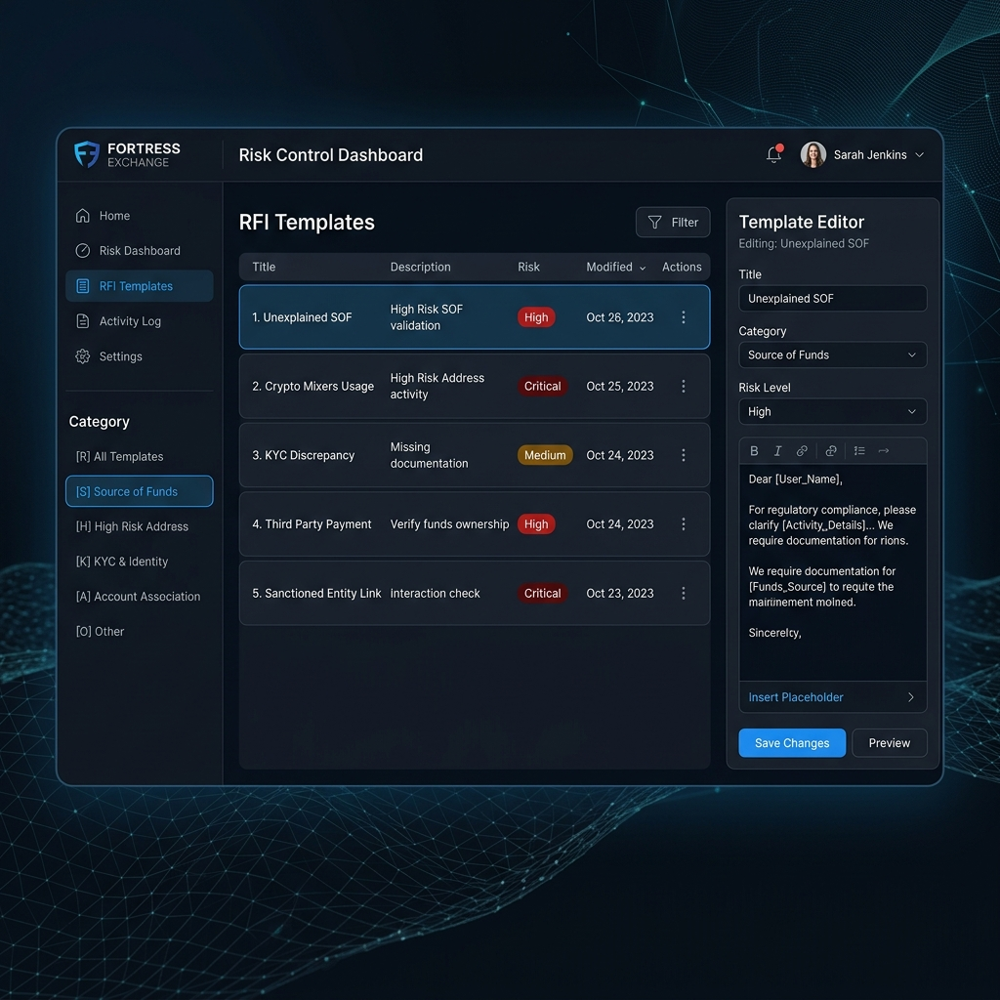

# 🛡️ RFI System — CEX 风控 RFI 模板管理系统 (v7)

[](LICENSE)
[]()
[]()

**CEX 风险控制与合规审核工具** —— 为中心化交易所（CEX）风控与合规团队量身定制的 Request for Information (RFI) 模板库和快捷管理平台。快速生成合规通知，提高合规性、反洗钱（AML/CFT）调查以及日常风险控制的工作效率。

---

## 📸 系统预览



---

## ✨ 核心特性

- **📂 模版精细化分类**
  - **资金来源 (Source of Funds)**：核查大额法币入金、链上资产不明来源等。
  - **高风险地址 (High Risk Address)**：检测暗网地址关联、混币器关联、受制裁实体关联等。
  - **异常行为 (Abnormal Behavior)**：核查小额分散（分层）、快进快出异常流向、登录异常操作等。
  - **身份核查 (KYC/UBO)**：核对 KYC 信息与交易不符、受益所有人 (UBO) 核查等。
  - **账户关联 (Account Association)**：核查多账户设备/IP关联、第三方代充等。
- **🚨 风险级别标识 (Risk Levels)**
  - 精准标注：`极高风险 (CRIT)`、`高风险 (HIGH)`、`中等风险 (MED)`、`低风险 (LOW)`。
- **🌐 双语模版系统**
  - 原生支持中文/英文模板，快速生成适应全球合规要求的双语通知。
- **⚙️ 动态字段渲染与实时编辑**
  - 系统智能提取模板占位符（如 `[用户UID]`，`[TX Hash]` 等），提供快捷表单输入。
  - 支持一键复制（纯文本 / HTML / Markdown），快速粘贴至工单系统或邮件。
- **📊 工单状态追踪**
  - 管理发出的 RFI 状态：`已发送` ➔ `待回复` ➔ `已回复` ➔ `已关闭`。
- **🎨 极致视觉与交互**
  - 适配 **深色模式 (Monokai / Cyber Dark)** 与 **浅色模式 (Premium Slate Light)**。
  - 基于高斯模糊 (Glassmorphism) 的毛玻璃头部导航与流畅微动动画。

---

## 🛠️ 技术实现

- **前端架构**：单文件纯原生 HTML5 / CSS3 / ES6 JavaScript 架构，零外部依赖，极速秒开。
- **样式系统**：Vanilla CSS 变量控制，内置动态过渡动画。
- **无感适配**：自适应主流浏览器，支持本地状态化快捷编辑。

---

## 🚀 快速上手

1. 克隆本项目或下载最新代码：
   ```bash
   git clone https://github.com/lovemoganna/RFISystem.git
   ```
2. 直接双击或使用任意浏览器打开文件：
   ```file
   rfi-templates (1).html
   ```
3. 选择所需的 RFI 模板，在右侧填入具体用户信息，即可一键复制套用。
